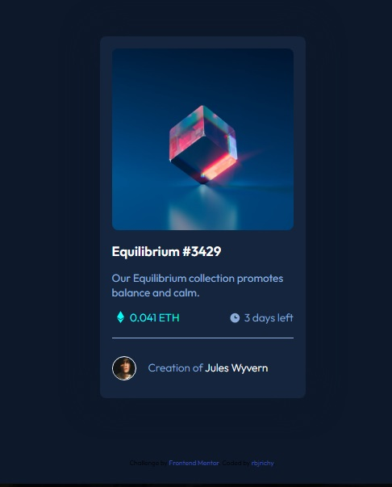

# Frontend Mentor - NFT preview card component solution

This is a solution to the [NFT preview card component challenge on Frontend Mentor](https://www.frontendmentor.io/challenges/nft-preview-card-component-SbdUL_w0U). Frontend Mentor challenges help you improve your coding skills by building realistic projects. 

## Table of contents

- [Overview](#overview)
  - [The challenge](#the-challenge)
  - [Screenshot](#screenshot)
  - [Links](#links)
- [My process](#my-process)
  - [Built with](#built-with)
  - [What I learned](#what-i-learned)
  - [Continued development](#continued-development)
  - [Useful resources](#useful-resources)
- [Author](#author)
- [Acknowledgments](#acknowledgments)

**Note: Delete this note and update the table of contents based on what sections you keep.**

## Overview

### The challenge

Users should be able to:

- View the optimal layout depending on their device's screen size
- See hover states for interactive elements

### Screenshot




### Links

- Solution URL: [Add solution URL here](https://your-solution-url.com)
- Live Site URL: [Add live site URL here](https://your-live-site-url.com)

## My process

### Built with

- Semantic HTML5 markup
- CSS custom properties
- Flexbox
- Mobile-first workflow


### What I learned

```html
<div class="imagen">
    
    <div class="overlay"></div>
    <div class="boton"></div>
</div>
```
```css
.imagen {
    max-height: 25rem;
    position: relative;
}
.imagen img{
    border-radius: 1rem;
    max-height: 25rem;
}
.overlay {
    position: absolute;
    width: 100%;
    height: 100%;
    top: 0;
    left: 0;
}
.imagen:hover .overlay {
    background: var(--cyan);
    opacity:.5;
    border-radius: 1rem;
}
.boton {
    position: absolute;
    width: 100%;
    height: 100%;
    top: 0;
    left: 0;
}
.imagen:hover .boton {
    background-image: url(../images/icon-view.svg);
    background-position: center;
    background-repeat: no-repeat;
    opacity:1;
    cursor: pointer;
}
```
### Continued development

I want to continue learning about positioning objects inside divs.

### Useful resources

- [Example resource 1](https://www.youtube.com/watch?v=4WlOokagtR4) - explains relative and absolute positioning properties.

## Author

- Frontend Mentor - [@yourusername](https://www.frontendmentor.io/profile/rbjrichy)
- Twitter - [@yourusername](https://www.twitter.com/rbjrichy)


## Acknowledgments

https://codigoconjuan.com/
